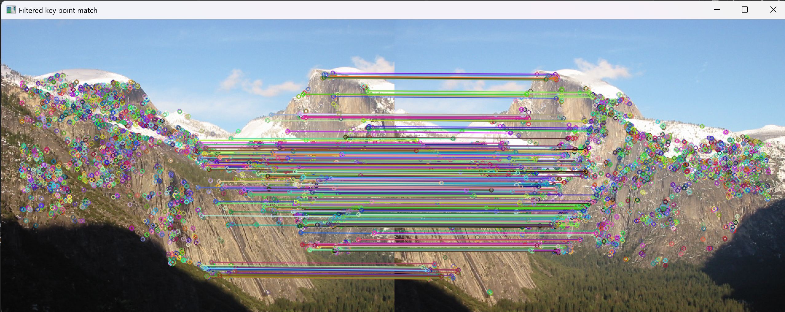
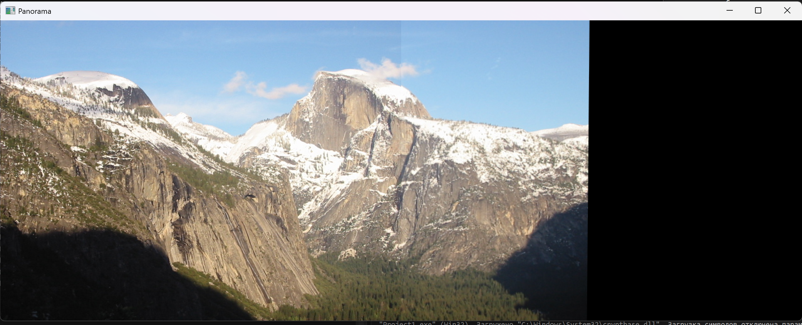

**Практика 7 (`opencv_7`)**:
   В этой практике мы должны анализ 2 изображений и используя дескрипторы (например ORB) найти точки, отфильровать их и склеить изображения в панораму.
   
   Промежуточный результат:
   
   Финальное изображение:
   