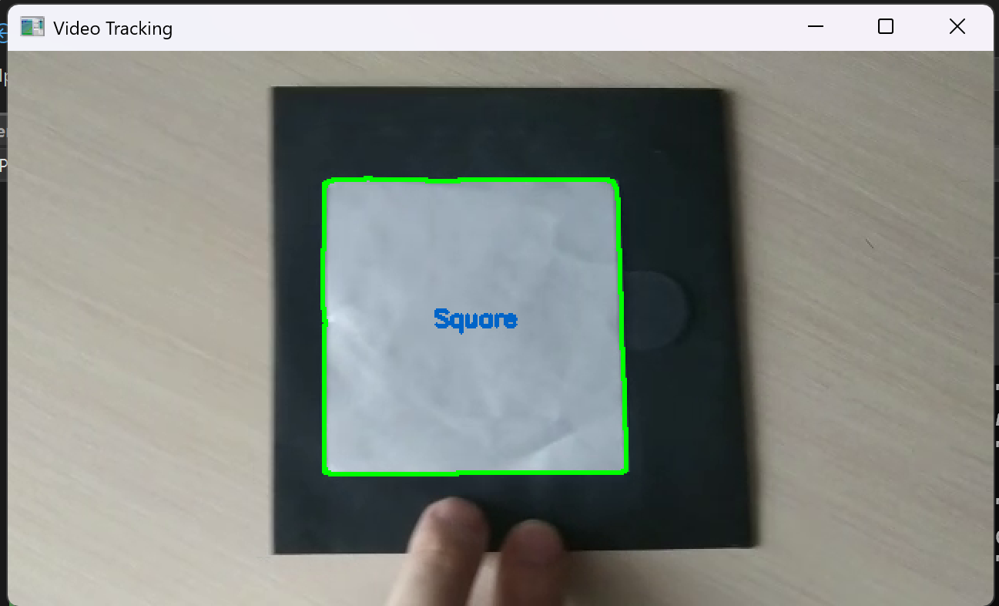

**Проект 1 (`opencv_1`)**:
   В этом проекте вы рисуете геометрические фигуры на изображении. Я описал рисование эллипса, но это может быть расширено и на другие фигуры. Код показывает, как использовать OpenCV для простых графических операций.  
   

**Проект 2 (`opencv_2`)**:
   Этот проект фокусируется на разделении изображения на 4 части и применении различных эффектов к каждому из сегментов. После обработки эти части соединяются обратно в одно изображение.  
   

**Практика 3 (`opencv_3`)**:
   В этой практике мы преобразуем BRG в разные цветовые пространства, а также ищем линии и круги на изображении, после чего рисуем их.
   
   

**Практика 4 (`opencv_4`)**:
   В этой практике мы берем маску inRange по цвету и соединяем ее с исходным изображением.
   

**Практика 5 (`opencv_5`)**:
   В этой практике мы должны найти контуры фигур и подписать их названия.
   

**Практика 6 (`opencv_6`)**:
   В этой практике мы должны выполнить контурный анализ и трекинг объекта на видео.
   
   